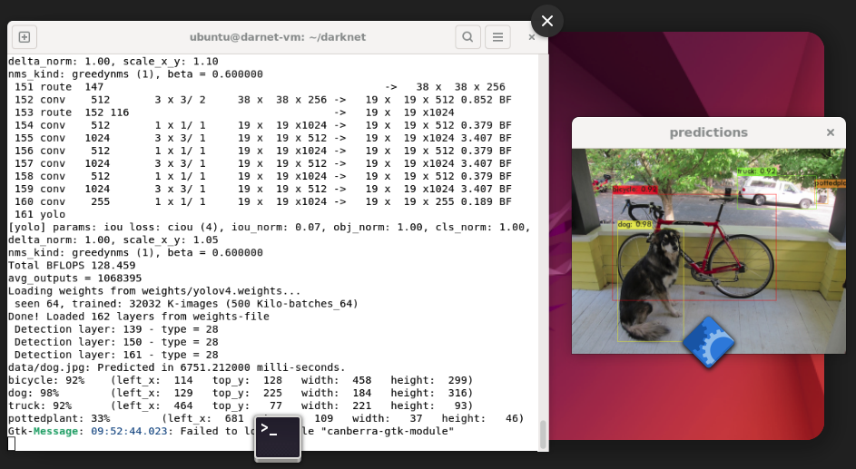

# VM

using multipass, create a Ubuntu 22.04 VM [with GUI](https://documentation.ubuntu.com/multipass/en/latest/how-to-guides/customise-multipass/set-up-a-graphical-interface/)

```
multipass info darnet-vm
Name:           darnet-vm
State:          Running
Snapshots:      0
IPv4:           192.168.64.4
Release:        Ubuntu 22.04.5 LTS
Image hash:     ec998e2141a1 (Ubuntu 22.04 LTS)
CPU(s):         2
Load:           0.01 0.11 0.08
Disk usage:     7.7GiB out of 61.9GiB
Memory usage:   732.8MiB out of 7.7GiB
Mounts:         --
```

Mount dev source

```bash
multipass mount ~/src darnet-vm:/home/ubuntu/Dev/yolo-course
```


# Opencv

1. Install dependancies
```bash
sudo apt update
sudo apt upgrade
sudo apt install build-essential cmake pkg-config yasm git gfortran
sudo apt install libxine2-dev libv4l-dev
sudo apt install libgstreamer0.10-dev libgstreamer-plugins-base0.10-dev
sudo apt install qt5-default libgtk2.0-dev libtbb-dev
sudo apt install libatlas-base-dev
sudo apt install libfaac-dev libmp3lame-dev libtheora-dev libvorbis-dev libxvidcore-dev
sudo apt install libopencore-amrnb-dev libopencore-amrwb-dev
sudo apt install x264 v4l-utils
sudo apt install python3-dev python3-pip
sudo -H pip3 install -U pip numpy
```

2. Install Opencv from source

```bash
cd ~
git clone https://github.com/opencv/opencv.git
cd opencv
git checkout 3.4.16 # Ensure you checkout the specific version 3.4.16
cd ..
git clone https://github.com/opencv/opencv_contrib.git
cd opencv_contrib
git checkout 3.4.16 # Ensure you checkout the specific version 3.4.16

cd ~/opencv
mkdir build
cd build
cmake -D CMAKE_BUILD_TYPE=RELEASE \
      -D CMAKE_INSTALL_PREFIX=/usr/local \
      -D INSTALL_PYTHON_EXAMPLES=ON \
      -D INSTALL_C_EXAMPLES=OFF \
      -D OPENCV_EXTRA_MODULES_PATH=../../opencv_contrib/modules \
      -D PYTHON_EXECUTABLE=/usr/bin/python3 \
      -D BUILD_EXAMPLES=ON ..
make -j$(nproc) # Use all available CPU cores for faster compilation
sudo make install
sudo ldconfig
```

3. Verify

```
import cv2
print(cv2.__version__)

3.4.16
```

# Darknet for Yolo

1. Clone darknet dev repo
```bash
cd ~/
git clone https://github.com/AlexeyAB/darknet.git
cd darknet
```

2. Update Makefile

```makefile
GPU=0
CUDNN=0
CUDNN_HALF=0
OPENCV=1  # <= 1 for supporting opencv 
AVX=0
OPENMP=0
LIBSO=0
ZED_CAMERA=0
ZED_CAMERA_v2_8=0
```

and build

```bash
make
```

3. Verify darknet

Download yolo weights

```bash
mkdir weights
cd weights
wget https://github.com/AlexeyAB/darknet/releases/download/darknet_yolo_v3_optimal/yolov4.weights
cd ..
./darknet detector test cfg/coco.data cfg/yolov4.cfg weights/yolov4.weights -ext_output data/dog.jpg
```

