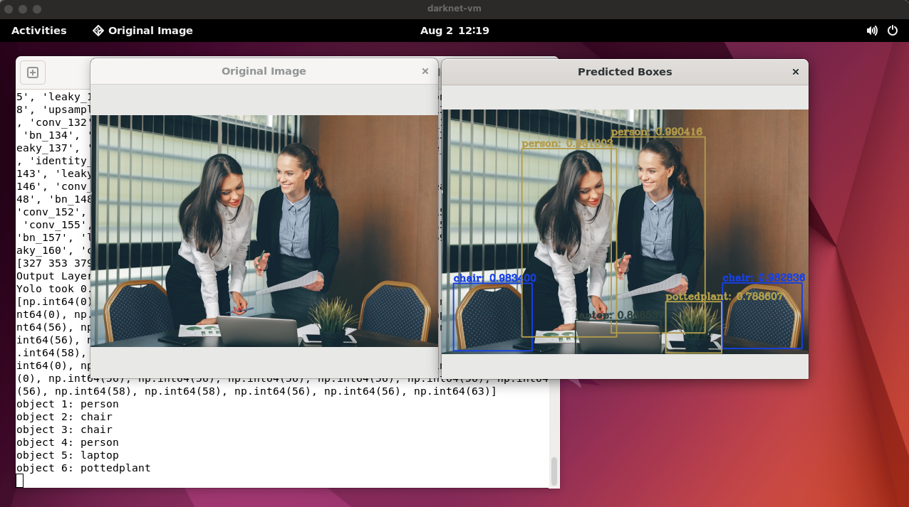
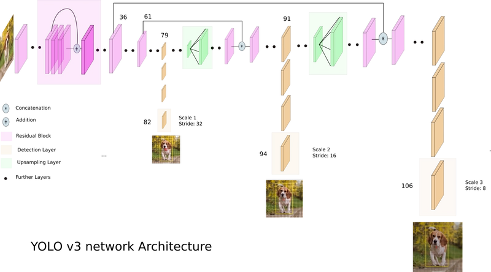

# Using Yolo with Opencv

1. download darknet model config and weights
2. read the model with dnn module ```cv2.dmm.readNetFromDarknet(cfg, weights)```
3. run inference and Non-Max Suppression





# Preparation for Training Data

## Create Annotated data for Yolo

Pair of input image and boxes

1. ```XYZ.jpg```
2. ```XYZ.txt```

where ```XYZ.txt``` contains Yolo box annotations ```(class, x_center, y_center, b_width, b_height)```:

```txt
box1_class_id box1_x_center box1_y_center box1_width box1_height
box2_class_id box2_x_center box2_y_center box2_width box2_height
...
```

## Create train, test set and data configs

1. ```classes.names``` for list of labeled class names, each per line
2. ```train.txt``` for list of absolute path to the input images, with annotated boxes in the same folder
3. ```test.txt``` same format as ```train.txt``` but for validation
4. ```dataset.data``` with the format

```txt
classes = number_of_classes
train = absolute path to train.txt file
valid = absolute path to test.txt file
names = absolute path to classes.names file
backup = path to folder to store weight checkpoints
```

## YoloV3 config file

```yolov3.cfg```

### Parameters for training

- ```learning_rate```: learning rate
- ```angle```: randomly rotating during training
- ```saturation```: randomly changing saturation during training
- ```exposure```: randomly changing of brightness
- ```hue```: randomly changing hue
- ```max_batches```: number of classes times 2000 but not less than 4000 -> number of interations of training
- ```steps```: number of iterations after which learning rate will be reduced by a scaling factor -> 80%, 90% of max_batches
- ```batch```: size of a batch (number of images for each iteration)
- ```subdivisions```: number of mini batches -> size of mini batch = batch / subdivisions

### Stucture of CNN layers

- ```filters```: number of filters
- ```activation```: activation function
- ```size```: size of filter
- ```stride```: stride of CV mask
  
### Last 3 Yolo layers



```
[convolutional] # filters = (classes + number of coordinates + 1) * masks = (80 + 5) * 3 = 255
[yolo]

[convolutional] # filters = (classes + number of coordinates + 1) * masks = (80 + 5) * 3 = 255
[yolo]

[convolutional] # filters = (classes + number of coordinates + 1) * masks = (80 + 5) * 3 = 255
[yolo]
```

